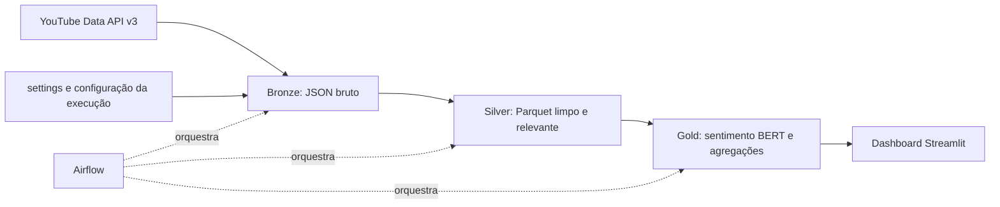

# Arquitetura

O pipeline processa manifestações públicas do YouTube ligadas às campanhas para o Governo do Ceará em 2026. Cada execução recebe um `run_id` UTC e mantém configuração, dados Bronze, Silver e Gold isolados no diretório `data/`.

## Diagrama

## Camadas obrigatórias

| Camada | Onde aparece no projeto | Evidência ou decisão |
| --- | --- | --- |
| Ingestão | `src/bronze_collect_videos.py` e `src/bronze_collect_comments.py` | Consulta a YouTube Data API v3 para vídeos, comentários e respostas públicas. |
| Armazenamento | `data/{config,bronze,silver,gold}/<run_id>/` | Preserva JSON bruto em Bronze e Parquet nas camadas tratadas, isolados por execução. |
| Transformação | `src/silver/`, `src/silver_transform_*.py` e `src/gold_*.py` | Filtra relevância, limpa e padroniza dados, classifica sentimento e produz séries e agregações. |
| Orquestração | `dags/youtube_pipeline.py` | DAG Airflow encadeia configuração, Bronze, Silver e Gold, com duas tentativas por tarefa. |
| Qualidade | `src/bronze_collect_*.py`, `src/silver/relevance.py` e `src/silver_select_relevant_videos.py` | Valida datas e esquemas de configuração; registros não relevantes são preservados em `videos_descartados.parquet`. |
| Consumo | `dashboard/streamlit_app.py` e `dashboard/pages/` | Dashboard Streamlit consulta uma execução Gold completa, com anonimização de trechos de comentários exibidos. |
| Infraestrutura e versão | `Dockerfile`, `docker-compose.yaml`, `requirements.txt` e Git | Docker Compose sobe PostgreSQL, Airflow e dashboard; a chave da API permanece fora do versionamento. |

## Decisões e alternativas

- O MVP usa YouTube como única fonte pública, reduzindo dependências e permitindo reproduzir a coleta por API autorizada.
- A arquitetura usa arquivos JSON e Parquet locais em vez de um data lake externo, apropriada ao volume do projeto e à execução com Docker Compose.
- O Airflow executa sob `LocalExecutor`; processamento distribuído não é necessário para o volume esperado.
- O modelo `nlptown/bert-base-multilingual-uncased-sentiment` fornece a classificação de sentimento dos comentários. Os resultados são sinais analíticos e não avaliação definitiva de opinião política.
